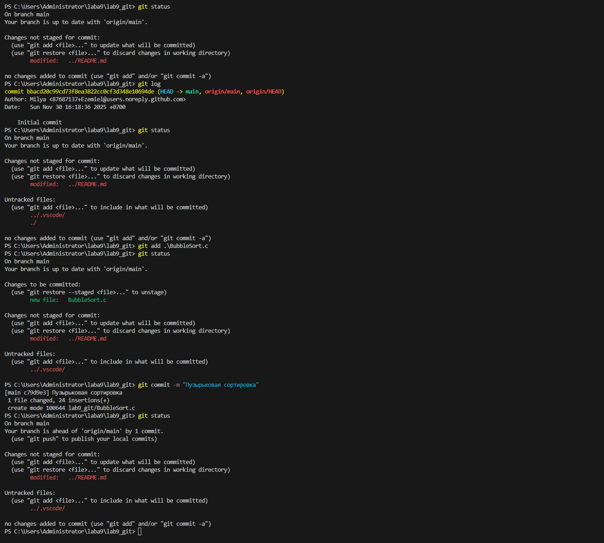

## Лабораторная работа № 9

Работа с Git



## 1-8 шага

1. Первым делом знакомимся с командой `git status`. Она показывает текущее состояние вашего репозитория. Вывод может быть следующим:
    ``` 
    On branch main
    Your branch is up to date with 'origin/main'
    (use "git add <file>..." to update what will be committed)
    (use "git restore <file>..." to discard changes in working directory)
    
    и.т.д.
    ```
    Показывает в какой ветке находимся и какие можно использовать в дальнейшем команды.

* git status — это команда в системе контроля версий Git, которая показывает текущее состояние рабочей директории и индекса (staging area). 

2. После просмотра статуса перейдем к просмотру истории коммитов через команду `git log`. Она показывает историю всех коммитов в вашем репозитории, начиная с самого старого. Вывод её состоит из таких параметров как:
``` 
commit <commit-hash> (HEAD -> main, origin/main, origin/HEAD)
Author: <author-name> <author-email>
Date:   <date> <time>
    <commit-message>
```
* git log — это команда в системе контроля версий Git, которая показывает историю всех коммитов в вашем репозитории, начиная с самого старого.

3. Далее добавим файл с разрешением .c либо через терминальные команды, либо же создадим функциям Visual Code. Сам файл - [BubbleSort.c] и его содержимое:

```
#include <stdio.h>
 int main() {
    int n, i, j;
     scanf_s("%d", &n);
    int a[n];
    // считываем количество чисел n

    // формируем массив n чисел
    for(i = 0 ; i < n; i++) { 
        scanf_s("%d", &a[i]);
    }
    for(i = 0 ; i < n - 1; i++) { 
       // сравниваем два соседних элемента.
       for(j = 0 ; j < n - i - 1 ; j++) {  
           if(a[j] > a[j+1]) {           
              // если они идут в неправильном порядке, то  
              //  меняем их местами. 
              int tmp = a[j];
              a[j] = a[j+1] ;
              a[j+1] = tmp; 
           }
        }
    }
 }

```
4. Далее также проверяем статус Git через команду из шага 1 -`git status`, файл нашей сортировки пока что не индексирован. 

5. Добавим его в индекс с помощью команды `git add`. 
* git add — это команда в системе контроля версий Git, которая добавляет файл в индекс (staging area).

6. После этого снова проверим статус Git с помощью команды `git status` и видим что файл теперь индексирован и в том числе окрасился в зелёный цвет и добавилась приставка "new file:" Вывод команды следующий: 

```
On branch main
Your branch is up to date with 'origin/main'
Changes to be commited:
  (use "git restore <file>..." to discard changes in working directory)
  new file:   BubbleSort.c
Changes not staged for commit:
  (use "git add <file>..." to update what will be committed)
  (use git restore <file>..." to discard changes in working directory)
```

7. Теперь можно сделать коммит с помощью команды `git commit`. Ввод команды следующий:
``` [main <commit-hash>]  "Пузырьковая сортировка"
1 file changed, 24 insertions(+)
create mode 100644 lab9_git/BubbleSort.c
```
* git commit — это команда в системе контроля версий Git, которая создает новый коммит с указанным сообщением.

8. Также как в 1 и в 4 шаге, проверим статус Git с помощью команды `git status` и вывод следующий:

```
On branch main
Your branch is ahead of 'origin/main' by 1 commit.
```

## Продолжение

Работа с Git

.png)
.png)

## 9-17 шага

9. Здесь делаем комментарий к нашему коду в файле [BubbleSort.c];

10. После чего смотрим git status как видно что после внесения изменений в файл, он не индексирован и в целом приобрёл красный цвет и приставку "modified:". Вывод следующий:
```
On branch main
Your branch is ahead of 'origin/main' by 1 commit.
(use git push to publish your local commits)
 Changes to be committed:
 (use "git add <file>..." to update what will be committed)
 (use "git restore <file>..." to discard changes in working directory)
 modified:   BubbleSort.c
```

11. Также индексируем наш [BubbleSort.c] с помощью команды `git add`.

12. Теперь наш комментарий что мы добавили также индексирован как и весь файл `BubbleSort.c` и снова стал зеленого цвета. Вывод команды следующий:
```
On branch main
Your branch is ahead of 'origin/main' by 1 commit.
(use git push to publish your local commits)
Changes to be committed:
 (use "git restore <file>..." to discard changes in working directory)
 modified:   BubbleSort.c
```

13. Добавим после наших всех шагов ещё один комментарий чтобы убедиться что всё работает как мы и предполагаем, то есть:
- Добавили/изменили что-то в файле что уже проиндексирован;
- В `git status` пишется что он уже не проиндексирован и окрашен в зелёный;
- Сработаем через команду `git add` и наш файл успешно проиндексирован и готов к коммиту.

14. Коммитим всё это дело как в шаге 7 с помощью команды `git commit`.

15. Проверка также `git status` и `git log` с подпараметром `--oneline`. Вывод следующий:
```
[commit-hash] (HEAD -> main, origin/main, origin/HEAD)  "Комментарий к сортировке"

и остальные коммиты что мы делали
```

16. Добавим после просмотра статуса и логов наш [BubbleSort.c] опять через команду `git add`. 

17. После чего всё это дело отправим на удалённый репозиторий с командой `git push`. Вывод команды следующий:

```
Enumerating objects: 13, done.
Counting objects: 100% (13/13), done.
Delta compression using up to 12 threads.
Compressing objects: 100% (13/13), done.
Compressing objects: 100% (13/13), done.
Writing objects: 100% (13/13), 2.1 KiB | 2.1 KiB/s, done.
Total 12 (delta 0), reused 0 (delta 0), pack-reused 0
To https://github.com/username/lab9_git.git
[commit-hash]..[commit-hash] main -> main
```
* git push - - это команда в системе контроля версий Git, которая отправляет все ваши коммиты на удалённый репозиторий.


## Продолжение

Работа с ветками

.png)
.png)
.png)
## 1-17 шага

1. Создадим ветку и тут же перейдём в неё с помощью команды `git checkout -b <new-branch-name>`. Вывод сообщения будет таким:
```
Switched to a new branch 'new-branch-name'
```
* git checkout - это команда в системе контроля версий Git, которая создает новую ветку и переключается на её;

2. Тут же просмотрим ветки что существуют в нашем репозитории, в том числе и новую что создали в 1-ом шаге через команду `git branch`. Видим что существуют две ветки, 1-ая main (существуют сразу при создании репозитория на Github), 2 - мы создали уже сами, видим с ней символ "*" - это означает что она активна и мы в ней находимся на данный момент и также ветка окрашена в зелёный цвет .Вывод следующий:

```
main
*mybranch
```
* git branch - это команда в системе контроля версий Git, которая показывает все ветки в вашем репозитории.

3. Попробуем другую команду переключения на туже ветку что и создали для закрепления знаний `git switch mybranch`. Вывод сообщения будет таким:
```
Already on 'mybranch'
```
* git switch - это команда в системе контроля версий Git, которая переключает на указанную ветку.

4. Переключимся на ветку основную - main, проверим её статус также и тут же переключимся на новую ветку - mybranch и её также статус проверим. Вывод команды git switch main:
```
Switched to branch 'main'
Your branch is up to date with 'origin/main'
```
git status её вывод:
```
On branch main
Your branch is up to date with 'origin/main'
Changes not staged for commit:
  (use git add <file>..." to update what will be committed)
  (use git restore <file>..." to discard changes in working directory)

```
Вывод команды git switch mybranch:

```
Switched to branch 'mybranch'
```
git status её вывод:

```
On branch mybranch
Changed not staged for commit:
  (use git add <file>..." to update what will be committed)
  (use git restore <file>..." to discard changes in working directory)
```
5. Проверим что сейчас мы находимся на ветке mybranch через команду `git branch`;

6. Создадим файл через команду echo в нашей ветке [file1.txt];
* echo - это команда в системе контроля версий Git, которая выводит указанное сообщение в стандартный вывод.

7. После чего инициализируем и коммитим в эту ветку с помощью команды `git add` и `git commit -m "Добавили файл file1.txt"`. Вывод команды следующий:

```
[main <commit-hash>]  "Добавили файл file1.txt"
1 file changed, 0 insertions(+), 0 deletions(-)
create mode 100644 file1.txt
```

8. Просмотрим логи с подпараметрами такими как `--oneline` и `--graph` - она выведет графичную структуру коммитов и логи в одну строку. Вывод команды следующий:

```
* [commit-hash] (HEAD -> mybranch)  "Добавили файл file1.txt"
```

9. Далее вернёмся обратно на главную ветку проекта `git switch main`;

10. Просмотрим логи с подпараметрами такими как `--oneline` и `--graph`. Выводит сообщения следующий:
```
[commit-hash] (HEAD -> main)  "Комментарий к сортировке"
и другие коммиты
```
Пока что тут ничего нету, пока мы не сделаем те же действия что и в прошлый раз, но в ветке main

11. Сделаем всё также что и в шагах 6-8, то есть создадим файл [file2.txt], иниализируем его и коммитим в эту ветку с помощью команды `git add` и `git commit -m "Добавили файл file2.txt"`. 

12. Просмотрим всё ветки командой `git log` с теми же подпараметрами `--oneline`, `graph` к ним ещё подключим `--all` - она выведет все ветки в вашем репозитории, включая и удалённые. Вывод команды следующий:
```
 * [commit-hash] (HEAD -> main)  "Добавили файл file2.txt"
| * [commit-hash] (mybranch) "Добавили файл file1.txt"
|/ 
```
Видим что начался строится график из слэшей, чтобы обозначить где идёт разделения проекта на разные ветки.

13. Опять переключимся на mybranch.

14. Проверим наличие файла file2.txt через команду dir
* dir - это команда в системе контроля версий Git, которая выводит содержимое текущей рабочей директории.

15. Проведем сравнение веток через  `git diff main mybranch`. Вывод команды следующий:
```
diff --git a/file1.txt b/file1.txt
deleted file mode 100644
index [...]
Binary files a/file1.txt and /dev/null differ
diff --git a/file2.txt b/file2.txt
new file mode 100644
index [...]
Binary files /dev/null and b/file2.txt differ
```
* git diff - это команда в системе контроля версий Git, которая выводит различия между двумя ветками. 

16. После чего всё наши скриншоты и README.md закидаем в ветку mybranch, а потом отправим на удалённый репозиторий с помощью `git push` с подпараметрами как `-u` - создаёт на удалённом репозитории ветку если её ещё нету, соотвествующей вашей локальной и связывает их, `origin` - имя удалённого репозитория, `mybranch` - имя вашей локальной ветки.

17. Переключимся на main и также отправим её данные на удалённый репозиторий.