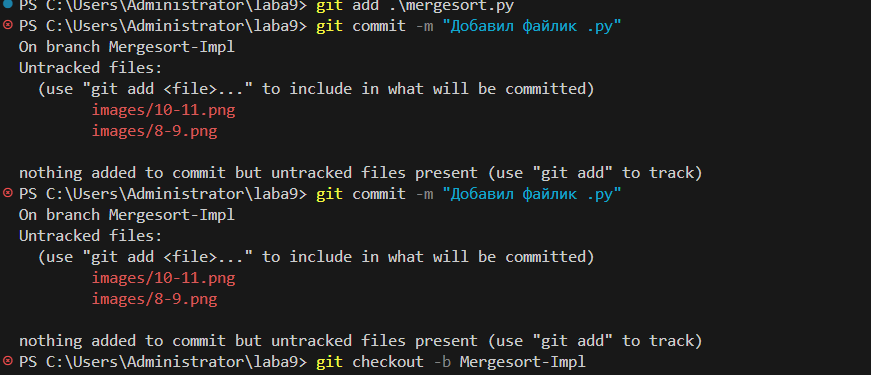
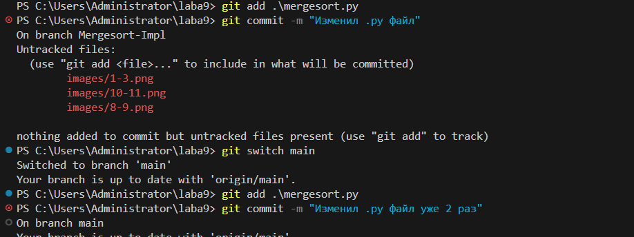
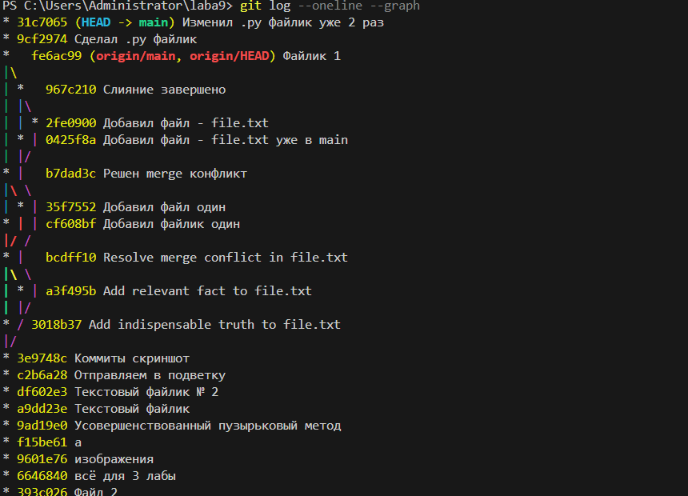
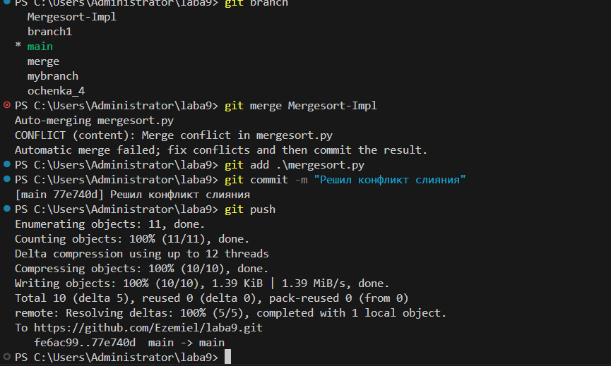

# laba9
Лабораторная работа № 9
## Лабораторная работа № 9

Конфликт с mergesort



## 1-4 шага

1. Создадим файл [mergesort.py](mergesort.py) и добавим следующий код:
```
def merge_sort(m):
    """Sort list m, using merge sort"""
    return m.sort() # TODO: Replace with actual implementation
```
2. Заиндексируем его через команду `git add`;

3. Также зафиксируем всё командой `git commit` с подпараметром `-m`;

4. После всех 3 шагов, сделаем новую ветку с заголовком `Mergesort-Impl` через команду `git checkout`;



## 5-6 шага

5. Также повторим 2-3 шаг и для новой созданной ветки в шаге 4, код файла [mergesort.py](mergesort.py):
```
from heapq import merge

def merge_sort2(m):
    """Sort list, using two part merge sort"""
    if len(m) <= 1:
        return m
    # Determine the pivot point
    middle = len(m) // 2
    # Split the list at the pivot
    right = m[middle:]
    left = m[:middle]
    # Sort recursively
    right = merge_sort2(right)
    left = merge_sort2(left)
    # Merge and return
    return list(merge(right, left))

def merge_sort4(m):
    """Sort list, using four part merge sort"""
    if len(m) <= 4:
        return sorted(m)
    # Determine the pivot point
    middle = len(m) // 2
    leftMiddle = middle // 2
    rightMiddle = middle + leftMiddle
    # Split the list at the pivots
    first = m[:leftMiddle]
    second = m[leftMiddle:middle]
    third = m[middle:rightMiddle]
    fourth = m[rightMiddle:]
    # Sort recursively
    first = merge_sort4(first)
    second = merge_sort4(second)
    third = merge_sort4(third)
    fourth = merge_sort4(fourth)
    # Merge and return
    return list(merge(first,second, third, fourth))
```

6. Переключимся на главную ветку - `main` и сделаем всё тоже самое что в шаге назад, код файла [mergesort.py](mergesort.py):

```
from heapq import merge

def merge_sort2(m):
    """Sort list, using two part merge sort"""
    if len(m) <= 1:
        return m
    # Determine the pivot point
    middle = len(m) // 2
    # Split the list at the pivot
    left = m[:middle]
    right = m[middle:]
    # Sort recursively
    right = merge_sort2(right)
    left = merge_sort2(left)
    # Merge and return
    return list(merge(right, left))

def merge_sort4(m):
    """Sort list, using four part merge sort"""
    if len(m) <= 4:
        return sorted(m)
    # Determine the pivot point
    middle = len(m) // 2
    leftMiddle = middle // 2
    rightMiddle = middle + leftMiddle
    # Split the list at the pivots
    first = m[:leftMiddle]
    second = m[leftMiddle:middle]
    third = m[middle:rightMiddle]
    last = m[rightMiddle:]
    # Sort recursively
    first = merge_sort4(first)
    second = merge_sort4(second)
    third = merge_sort4(third)
    last = merge_sort4(last)
    # Merge and return
    return list(merge(first, second, third, last))
```



## 7 шаг

7. Видим всё наши коммиты и график что строится из-за различного содержания в ветках;

## 8-11 шага 



8. Видим что мы находимся на ветке через * `main` через команду git branch;

9. Попытаемся скрестить нашу главную ветку с доп.веткой `Mergesort-Impl` через команду `git merge`;

10. Видим что конфликт связан с файлом [mergesort.py](mergesort.py) и исправляем его усилиями VS Code;

11. Также индексируем, коммит и пушим всё это в ветку `main`.