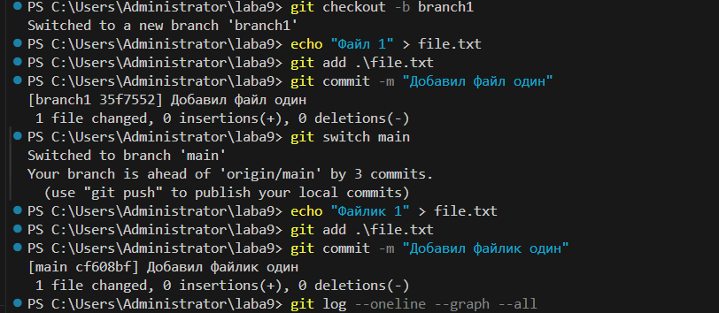
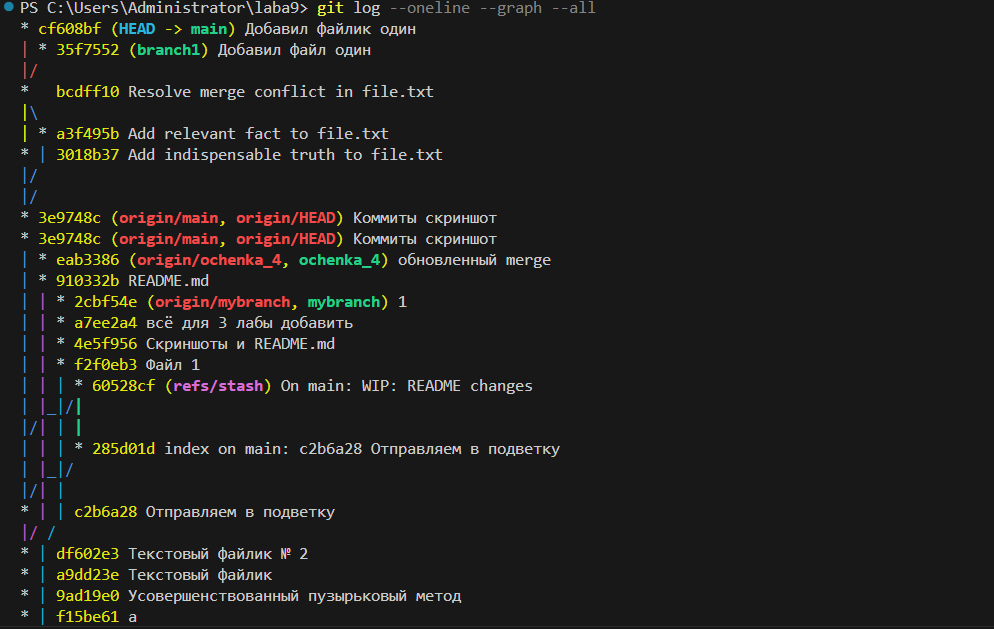
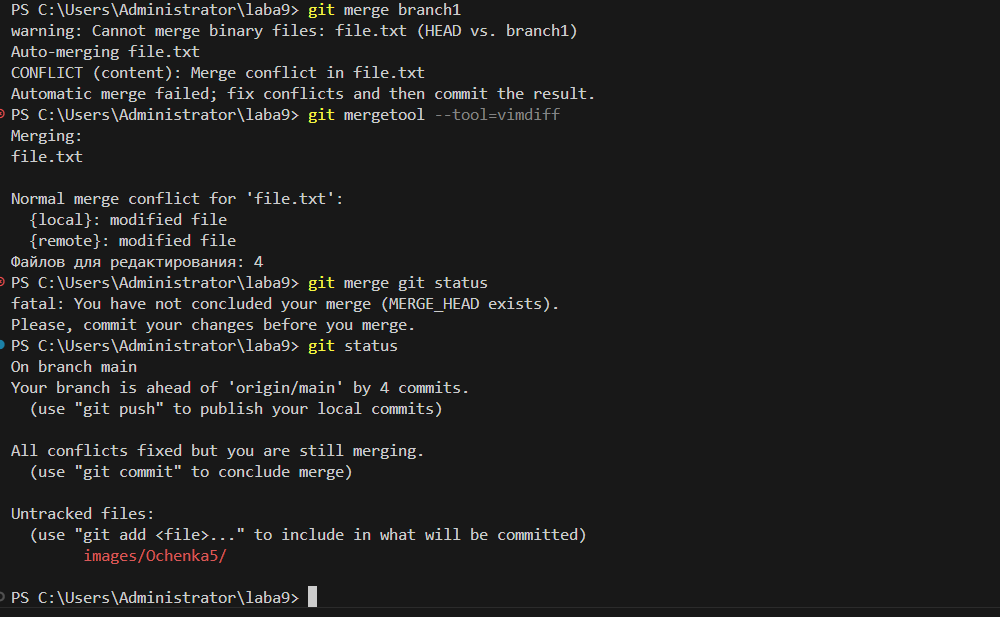

# laba9
Лабораторная работа № 9
## Лабораторная работа № 9

Работа на 5 оценку

## 1-6 шага

1. Создаем ветку опять используя команду `git checkout` с подпараметром `-b`;

2. После чего вносим новый текст в файл [file.txt](file.txt), текст "Файл 1";

3. Далее всё это индексируем командой `git add`;

4. Коммитим всё это дело для сохранения того что мы уже сделали;

5. Переключаемся на ветку главную - `main` через команду `git switch`;

6. Повторяем всё действия по 2-4 шаг, но уже для ветки `main`;

## 7 шаг

7. Смотрим через команду `git log` с подпараметрами `--oneline`, `--graph`, `--all` и видим что из-за того что файл - [file.txt](file.txt) имеет разное содержание в ветках, то график начал рисовать различные пути;

## 8-9

8. Попробуем сделать слияние веток через команду - `git merge`;

9. Ничего не получилось так как случился конфликт слияния из-за различий содержания в [file.txt](file.txt);

## 10-11

10. Решили в терминале конфликт слияния через команду `git mergetool` с подпараметрами `--tool`, `--vimdiff`, изменили так чтобы файлы не конфликтовали и слияние успешно завершилось;

 * git mergetool - открывает визуальный редактор для ручного слияния

11. Всё это дело опять индексировали, закоммитили и отправили в удаленный репозиторий командой `git push`.