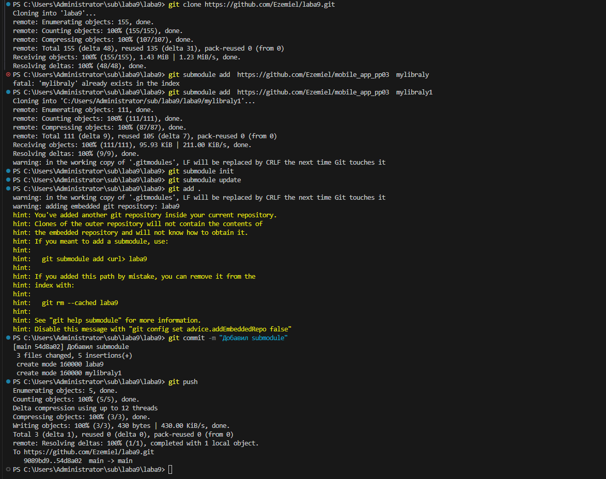

# laba9
Лабораторная работа № 9
## Лабораторная работа № 9

Работа с субмодулем

## 1-4 шага

1. Склонируем наш репозиторий командой `git clone`;
* git clone - создает копию репозитория на вашем компьютере.

2. После чего создаем через команду `git submodule` и подпараметром `add`, сам субмодуль - это ссылка на репозиторий внутри репозитория;
* git submodule - создает субмодуль в текущем каталоге.

3. Попробуем команду `git submodule init` и `git submodule update` чтобы файлы появлились;
* git submodule init - инициализирует субмодуль.
* git submodule update - обновляет субмодуль.

4. После всех шагов, сделаем `git add .` и закоммитив, отправим всё это на удаленный репозиторий - `git push`.